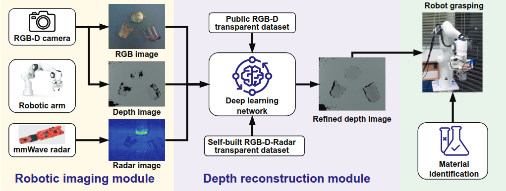
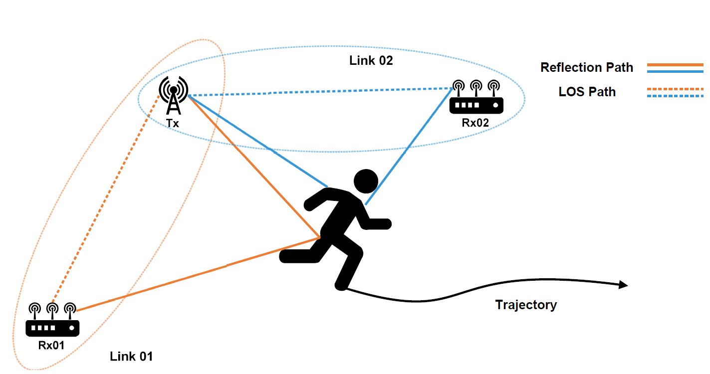

I am a fourth-year Ph.D. candidate in the Department of Information Engineering at **The Chinese University of Hong Kong (CUHK)**, advised by  [Prof. Henry He Chen](https://www.ie.cuhk.edu.hk/faculty/Chen-He-Henry/) and [Prof. Tianfan Xue](https://tianfan.info/) as part of the [Wireless Networking and Sensing (WiNS) Group](http://iiotc.ie.cuhk.edu.hk/). My research focuses on developing **wireless technologies for robotic platforms**. This work aims to enhance robot operational capabilities and improve wireless sensing with greater coverage.

Prior to joining CUHK, I conducted research at the [Intelligent Perception (IP) Lab](https://ustc-ip-lab.github.io/) at the **University of Electronic Science and Technology of China (UESTC)**, collaborating with [Prof. Yan Chen](https://scholar.google.com/citations?hl=en-EN&user=MVOCn1AAAAAJ) to develop **human-centric wireless sensing** systems. 

My work targeted performance and robustness improvements on wireless sensing, leading to innovations in following areas:

- **Robotic Manipulation**: Radar-camera fusion for transparent object grasping ([TMC'25](https://ieeexplore.ieee.org/document/10909339)).
- **Intelligent Sensing**: IRS-aided indoor localization ([TWC'25](https://ieeexplore.ieee.org/abstract/document/10994341), [TMC'24](https://ieeexplore.ieee.org/abstract/document/10557701)).
- **Mobile Health**: Contactless human speed estimation ([IoTJ'21](https://ieeexplore.ieee.org/abstract/document/9187251)).

Selected publications
======

  

      
  

  

    
FuseGrasp: Radar-Camera Fusion for Robotic Grasping of Transparent Objects 

    
<u>Hongyu Deng</u>, Tianfan Xue and He (Henry) Chen 

    
<em>IEEE Transactions on Mobile Computing, 2025.</em> 

    
<a href="https://eehydeng.github.io/fusegrasp/">Webpage</a>

  

  

      
  

  

    
SpeedNet: Indoor speed estimation with radio signals 

    
Yan Chen, <u>Hongyu Deng</u>, Dongheng Zhang and Yang Hu 

    
<em>IEEE Internet of Things Journal, 2021.</em> 

    <!-- 
<a href="">Project</a>
 -->
  

